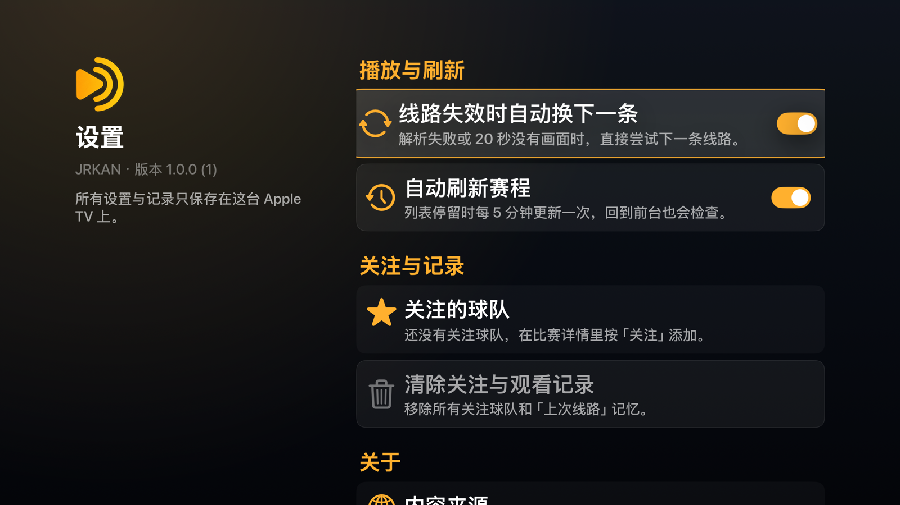
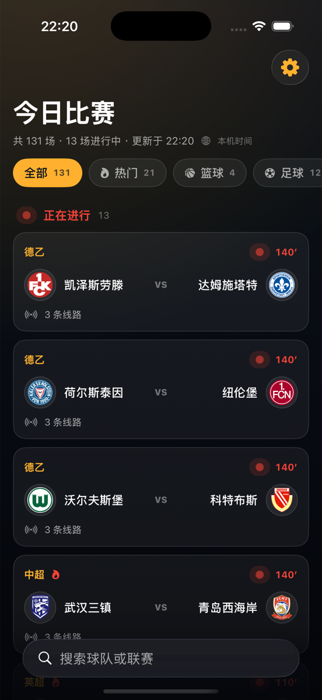
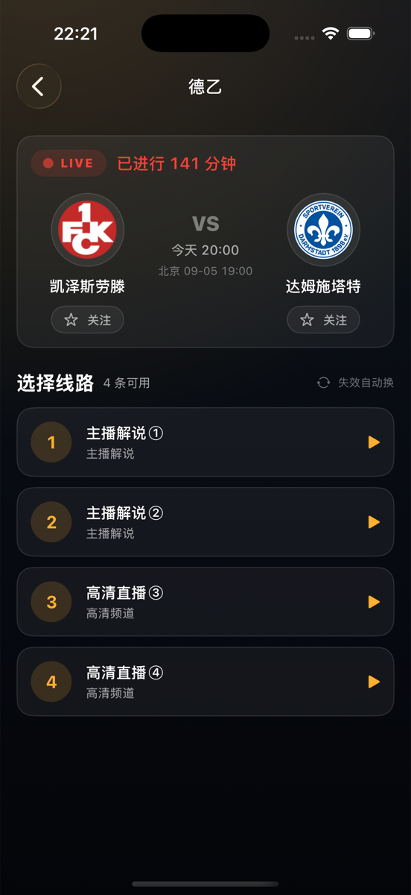

# JRKAN Apple TV

面向实体 Apple TV 的原生 tvOS 赛事观看应用，另有共用业务层的 iPhone / iPad 版。macOS 不在产品范围内。

tvOS 17+ · iOS 17+ · SwiftUI · AVFoundation · XcodeGen

---

## 界面

赛事列表。按「正在进行 / 即将开始 / 已结束」分组，进行中显示 LIVE 与已进行分钟数，开赛时间换算成本机时区；分类 chip 带场次，右侧是搜索、刷新、设置。


比赛详情。对阵 hero 带比赛状态与「关注」按钮；线路读取期间显示骨架屏，读取完成后焦点直接落在上次看过的线路（首次为第一条）。


设置。自动换线、自动刷新两个开关，关注与观看记录清除，以及内容来源、隐私、遥控器说明。



iPhone 版。同一套数据与播放逻辑，界面按触屏重排：分组列表、分类 chip、下拉刷新、搜索补全；详情页关注与线路；全屏播放带关闭与线路菜单，支持画中画与 AirPlay。

<p>
  
  
</p>

Top Shelf 横幅（2320×720），应用在主屏聚焦时显示。


应用图标（1280×768，三层视差合成预览）。琥珀主色贯穿图标、横幅、启动画面与界面。


> 截图取自 Apple TV 4K 模拟器实拍。播放页是全屏 `AVPlayerViewController`，带原生传输栏、LIVE 指示与 Info 面板；因画面内嵌第三方推广，此处不附播放截图。

---

## 能力

| 能力 | 实现 |
| --- | --- |
| 比赛列表 | 读取目标站点公开首页与动态列表脚本；线路地址按首页 `PLAY_HOSTS` 表还原 |
| 状态与排序 | 用开赛时间推导「进行中 / 即将开始 / 已结束」，进行中且有线路的排最前；每分钟自动重算 |
| 浏览 | 分类 chip（全部 / 关注 / 热门 / 篮球 / 足球），搜索带联赛名一键补全 |
| 关注 | 在详情页关注球队，列表出现「关注」分类与标记；只存本机 |
| 线路 | 第 1 步选比赛，第 2 步选具体频道；记住每场上次用的线路并默认聚焦 |
| 自动换线 | 解析失败或 20 秒无画面时自动尝试下一条，可在设置里关闭 |
| 播放 | 解析公开 iframe 与加密播放器链路，发现 HLS 后交给 AVPlayer 全屏播放；传输栏内可切换线路 |
| 刷新 | 列表每 5 分钟自动刷新、回到前台检查过期；刷新失败保留上次数据并提示 |
| 平台 | tvOS 17+ 与 iOS 17+ 两个目标共用 `App/Sources/Shared`；启动画面、空态插画、隐私清单齐备，最终验收设备为实体 Apple TV 与 iPhone |

## 构建与测试

```bash
xcodegen generate

xcodebuild -project JRKANApple.xcodeproj -scheme JRKANTV \
  -destination 'platform=tvOS Simulator,name=Apple TV 4K' test

xcodebuild -project JRKANApple.xcodeproj -scheme JRKANiOS \
  -destination 'platform=iOS Simulator,name=iPhone 17 Pro' test

xcodebuild -project JRKANApple.xcodeproj -scheme JRKANTV \
  -sdk appletvos -configuration Release build CODE_SIGNING_ALLOWED=NO
```

Debug 包支持启动参数直达页面，模拟器核对界面时不必模拟遥控器或点击：

```bash
xcrun simctl launch <udid> com.leeguoo.jrskan.tv -route play:live   # 最新开赛且有线路的比赛，直接播放
xcrun simctl launch <udid> com.leeguoo.jrskan.tv -route detail:0    # 当前分类第 1 场的详情
```

品牌资源与界面插画由脚本合成，**不要手改 `App/Resources/Assets.xcassets`**，下次运行会被整个覆盖：

```bash
python3 assets/brand/build_assets.py
```

原始素材由 `chatgpt-imagegen` 生成（`assets/brand/gen_art.sh`，状态插画要求纯黑底，脚本用亮度抠成透明）。

## TestFlight

```bash
Scripts/testflight.sh tvos            # 归档 → 用 ASC API 密钥云端签名 → 上传
Scripts/testflight.sh ios             # iPhone / iPad 版
Scripts/testflight.sh all 202609051   # 两端一起，指定构建号（缺省为时间戳）
```

前提：`~/.appstoreconnect/private_keys/AuthKey_<ID>.p8`（Admin / App Manager 角色），App Store Connect 里已有 Bundle ID 为 `com.leeguoo.jrskan.tv` 的 App 记录（App ID 6808947990，名称 JRKAN，SKU `JRKANTV-2026`，tvOS 与 iOS 两个平台挂同一条记录）。查构建处理状态：

```bash
python3 Scripts/asc_api.py GET "/v1/builds?filter[app]=6808947990&sort=-uploadedDate&limit=3"
```

> 模拟器测试和成功上传都不等于真机验收。完成标准是：在指定实体 Apple TV 上装上 TestFlight 构建，用遥控器打开应用、加载比赛列表、进入赛事并确认至少一条公开线路开始播放。

## 目录

| 路径 | 内容 |
| --- | --- |
| `App/Sources/Shared/` | 两端共用：模型、网络、解析、`MatchListModel`、`MatchPlaybackModel`（线路与播放状态）、`Preferences`、`DesignSystem` |
| `App/Sources/TV/` | tvOS 界面与 `AVPlayerViewController` 模态播放 |
| `App/Sources/iOS/` | iPhone / iPad 界面与全屏播放 |
| `App/Resources/` | tvOS 与 iOS 两套资源目录、启动画面 storyboard、隐私清单 |
| `assets/brand/` | 图标与插画原始素材、生成脚本、合成脚本 |
| `assets/store/` | 商店截图（3840×2160）与 README 用的缩略版 |
| `Scripts/` | TestFlight 上传脚本、导出配置、ASC API 最小客户端 |
| `docs/app-store-submission.html` | 上架准备：ASC 全部字段、隐私标签、审核信息模板与阻断项 |

## 边界

应用只读取公开页面，不托管或重分发视频，不绕过登录、DRM、付费墙或地域限制。线路由第三方维护，可能随时失效。

当前为兼容第三方 HTTP 页面启用了宽松网络策略（`NSAllowsArbitraryLoads`）。正式发布前应由自有 HTTPS 后端完成解析，并收紧 App Transport Security。

> **产品决定（2026-09-05）：只做 TestFlight 内部测试，永不提交 App Store。** 原因是当前播放链路输出的第三方流内嵌境外博彩推广，且转播的是持权赛事信号，这是开发者账号封停级别的组合。取证与曾经评估过的合规路线保留在 [`docs/app-store-submission.html`](docs/app-store-submission.html)，仅作记录。
>
> 内部测试的运行规则：只加团队成员进「内部测试」组，不建外部测试组、不开公开链接（外部分发会触发 Beta 审核，标准与提审相同）；TestFlight 构建 90 天过期，到期前跑一次 `Scripts/testflight.sh` 重新上传即可。
