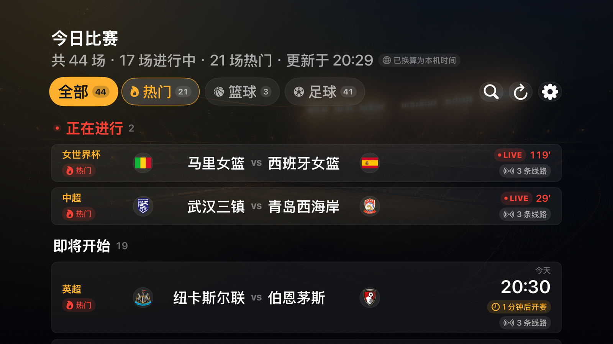
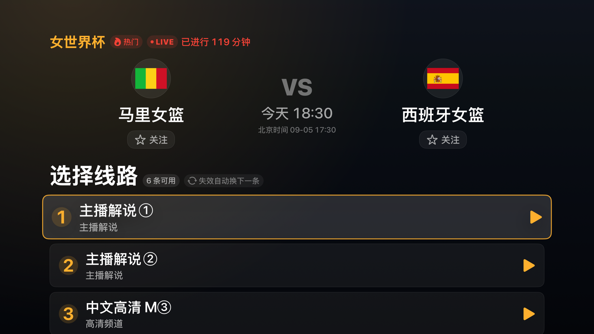

# JRKAN Apple TV

面向实体 Apple TV 的原生 tvOS 赛事观看应用。macOS 不在产品范围内。

tvOS 17+ · SwiftUI · AVFoundation · XcodeGen

---

## 界面

赛事列表。分类 chip 带各分类场次，卡片显示双方队徽、开赛时间与可用线路数，焦点态为琥珀描边。



比赛详情。对阵 hero 加编号线路卡片；线路读取期间显示骨架屏。



Top Shelf 横幅（2320×720），应用在主屏聚焦时显示。


应用图标（1280×768，三层视差合成预览）。琥珀主色贯穿图标、横幅与界面。


> 截图取自 Apple TV 4K 模拟器实拍。播放页是全屏 `AVPlayerViewController`，带原生传输栏、LIVE 指示与 Info 面板；因画面内嵌第三方推广，此处不附播放截图。

---

## 能力

| 能力 | 实现 |
| --- | --- |
| 比赛列表 | 读取目标站点公开首页与动态列表脚本 |
| 浏览 | 第 1 步选择比赛，第 2 步读取并选择具体频道，例如「中文高清 Q ⑤」 |
| 播放 | 解析公开 iframe 与加密播放器链路，发现 HLS 后交给 AVPlayer 全屏播放 |
| 播放器 | 原生传输栏、LIVE 指示、Info 面板；传输栏内可直接切换线路；20 秒无画面自动转错误态 |
| 平台 | tvOS 17+，最终验收设备为实体 Apple TV |

## 构建与测试

```bash
xcodegen generate

xcodebuild -project JRKANApple.xcodeproj -scheme JRKANTV \
  -destination 'platform=tvOS Simulator,name=Apple TV 4K (3rd generation)' test

xcodebuild -project JRKANApple.xcodeproj -scheme JRKANTV \
  -sdk appletvos -configuration Release build CODE_SIGNING_ALLOWED=NO
```

品牌资源由脚本合成，**不要手改 `App/Resources/Assets.xcassets`**，下次运行会被整个覆盖：

```bash
python3 assets/brand/build_assets.py
```

> 模拟器测试和成功生成 IPA 都不等于真机验收。完成标准是：安装到指定实体 Apple TV，用遥控器打开应用、加载比赛列表、进入赛事并确认至少一条公开线路开始播放。

## 目录

| 路径 | 内容 |
| --- | --- |
| `App/Sources/` | 应用源码（`DesignSystem.swift` 为配色、焦点卡片与骨架屏的统一定义） |
| `App/Resources/Assets.xcassets/` | tvOS 分层图标与 Top Shelf，由脚本生成 |
| `assets/brand/` | 图标原始素材与合成脚本 |
| `docs/app-store-submission.html` | 上架准备：ASC 全部字段、隐私标签、审核信息模板与阻断项 |

## 边界

应用只读取公开页面，不托管或重分发视频，不绕过登录、DRM、付费墙或地域限制。线路由第三方维护，可能随时失效。

当前为兼容第三方 HTTP 页面启用了宽松网络策略（`NSAllowsArbitraryLoads`）。正式发布前应由自有 HTTPS 后端完成解析，并收紧 App Transport Security。

> **这一版不能提交 App Store。** 实测当前播放链路输出的第三方流内嵌境外赌博站推广，且转播的是持权赛事信号；这属于开发者账号封停级别的组合，不是文案或素材能绕过的。详细取证与合规路线见 [`docs/app-store-submission.html`](docs/app-store-submission.html)。
